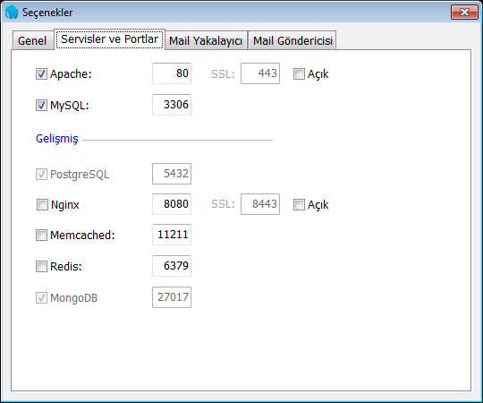

# Windows kurulumu

Windows'ta PHP kodlamaya ilk başladığım zamanlarda [**EasyPHP**](https://www.easyphp.org/), daha sonraları ApacheFriends'in [**XAMPP**](https://www.apachefriends.org/tr/index.html)'ı, ve en son karar kıldığım [**Laragon**](https://laragon.org/) hazır PHP stack'lerini kullandım. Hepsinin kurulumu oldukça basit, istediğiniz konfigürasyonu ayarlayabiliyorsunuz, örneğin ben Apache değil de NGINX kullanmak istiyorum diyorsanız ona göre dosya indiriyorsunuz ya da programın arayüzünden birini kapatıp diğerini açıyorsunuz vs, ancak ilk **Laragon**'u keşfettiğimde çok hoşuma giden bir özelliği vardı, ki hala o yüzden kullanıyorum, server kök klasörünün (bu konuya ileride tekrar değineceğim) içine örneğin _yenisitem_ isminde yeni bir klasör açtığınızda, otomatik olarak _yenisitem.dev_ adlı bir sanal websitesi oluşturuyor ve bu URL'ü kullanarak geliştirme yapabiliyorsunuz.

https://laragon.org/download/ adresinde Laragon size seçmeniz için 3 seçenek sunacak:

- **Laragon Full**: Apache 2.4, Nginx, MySQL 5.7, PHP 7.2, Redis, Memcached, `Node.js 11, npm, yarn, git`,… bütün sunabildiği paketleri içine dahil etmiş ve toplam boyut 130MB olmuş.

- **Laragon Lite**: Full paketten `Node.js 11, npm, yarn, git` özelliklerini çıkartmış ve kurulum boyutunu 85MB'a indirmiş. Çıkartılan özelliklerle bizim bir işimiz yok, ayrıca bunların her birinin ayrı sitelerinde setup dosyaları mevcut. Daha sonra ihtiyacınız olduğunda da indirebilirsiniz.

- **Laragon Portable**:  İndir ve kullanmaya başla şeklinde paketlenmiş, sağa sola kolayca taşıyabileceğiniz PHP 5.4 ve MySQL 5.1 kurulumlarını içerir. Sitesinde PHP'ye başlamak için güzel bir paket olarak tanımlanmış, daha sonrasında PHP versiyonuna ihtiyacınız olduğunda kendiniz ekleyebilirsiniz şeklinde de açıklama yapılmış. 18MB'a düşürmüşler paketi. 

İstediğiniz herhangi birini indirebilirsiniz. Bu dili öğrenmek adına başlangıçta bir sorun oluşturmayacaktır, ancak güncel kalmak adına PHP7 ve üzeri herhangi bir versiyonu seçmeniz, ileride anlatılacaklarda sorun yaşamamanız için önemli olabilir. Ben diğer çıkartılan özellikleri de kullandığım için _Full_ paketi indiriyorum. 

## Kurulum

Programı indirdikten sonra **İleri**, **İleri**, **İleri**, .. **Kur** butonlarını tıklamak suretiyle yazılımı kuruyorum ve kurulum bittikten sonra **Laragon programını çalıştır** kutucuğu işaretli şekilde **Bitir** butonuna tıklıyorum. 

Program çalıştıktan sonra beni şu ekran karşılıyor: 

**Hepsini Başlat** butonuna tıklayarak Apache ve MySQL programlarını başlatıyorum. 

Ancak windows'ta bu programların ağa erişebilmesi için - eğer windows firewall'ınız açıksa - özel izinler vermeniz gerekiyor. Şuna benzeyen iki ekran çıkacaktır karşınıza:

İlki MySQL veritabanı sunucusu için, ikincisi Apache web server için izinler isteyecek. Kabul edin.

Bu izinleri verdikten sonra Laragon, servisleri başlatacaktır ve ekran şu şekilde değişecektir:

Bu ekranda Apache'nin (httpd) 80. porttan sunuma hazır olduğunu, MySQL servisinin de 3306. porttan veri alışverişine hazır olduğunu görebiliriz. Apache'nin yanındaki **Yenile** butonu, servisi durdurup yeniden başlatmanızı sağlar ki, bu serviste herhangi bir ayar değiştirdiğiniz zaman servisin bu ayarı devreye alması için bunu yapmanız gereklidir. **Hepsini Başlat** butonunun, hepsini başlattıktan sonra **Durdur** butonuna dönüştüğünü farketmişsinizdir bile.

Ekrandaki butonların bunun dışında olanlarını pek kullanmayacaksınız, çünkü ileride ne işe yaradıklarını bildiğiniz için daha kısa yoldan veya farklı araçlar kullanarak kendiniz erişebileceksiniz zaten. Ama şimdilik bilmeniz gereken tek bir buton var, o da **Root**. Root demek _Kök_ demek, ve bu buton sizi web sunucunuzun sunacağı sayfaların bulunduğu _kök dizini_'ne götürecektir. Bu klasör dışında kalan sayfalar sunulmaz, çünkü sunucu tarafından erişilemez. Butona tıkladığınızda sizi bu ekran karşılar (kurulum yaparken laragon'u nereye kurduğunuza bağlıdır, ben varsayılan ayarları kullanarak **c:\laragon** dizinine kurdum, o yüzden kök klasörüm **c:\laragon\www** oldu):

Klasör içinde laragon'un otomatik olarak oluşturduğu **index.php** dosyası mevcuttur. PHP dosyaları *.php ile biter, ve bir klasörde index.php dosyası varsa, tarayıcıya o klasörün yolu yazıldığında otomatik olarak o kod dosyası çalıştırılır. 

Bu klasör, Apache tarafından http://localhost adresine bağlanmıştır. _Local host_, yerel sunucu manasına gelir ve bu bütün web sunumu yapan programlama dillerinde aynıdır, aynı yere yönlenir: http://127.0.0.1.  Bu iki adresten birine tarayıcınızla girdiğinizde, kök dizininde bulunan _index.php_ dosyasının çıktısı görüntülenir:

Bu çıktıyı almamız, herşeyin yolunda olduğunu, artık PHP yazmaya hazır bir sunucumuzun olduğunu gösterir.

## Yeni site oluşturma

Bir de Laragon'un ekstra özelliği olan otomatik *.test domaini oluşturma hakkında biraz bilgi vereyim, örnek olarak http://yenisitem.test adresinde _c:\laragon\www\yenisitem_ klasöründe bulunan bir siteyi sunmak istiyorsunuz. 

Bunun için yapmanız gereken şey, _c:\laragon\www\yenisitem_ klasörünü oluşturmak, ve Apache'yi yeniden başlatmak. (Resimdeki **Yenile** butonu bu işe yarıyor) Laragon sizin için otomatik olarak tüm yapılması gerekenleri gerçekleştiriyor.

http://yenisitem.test adresine girdiğinizde, klasör içinde bir dosya olmadığından, sizi şu ekran karşılayacak

---

## Ekstra ayarlar

Bu ekranda sağ üst köşede bulunan ayarlar simgesine tıkladığınızda şu ekranla karşılaşırsınız:

Buradan yapabileceğiniz ayarlar şunlardır:

* **Laragon'u Windows başlayınca başlat**: Her şey ortada, anlatmaya gerek yok, görüyorsunuz.

* **Küçültülmüş halde başlat**: Laragon başladığında ekran görüntülenmez, arkaplanda sağ alt köşede sessizce başlar. Aksi halde açıldığında laragon ekranı görüntülenir.

* **Hepsini otomatik olarak başlat**: Windows açılırken Laragon başlatıldığında otomatik olarak servisleri de başlatır ya da başlatmaz. Eğer sürekli PHP ile geliştirme yapan biri değilseniz, ve MySQL, Apache, Redis vs servisler işinize yaramıyorsa, açılışta hepsini başlatmanıza gerek yok, zira RAM'den boşuna alan kaplayacaktır (MySQL azımsanacak bir yer kaplamıyor çoğu zaman). 

Ama sürekli geliştirme için ben üç seçeneği de açık bırakıyorum.

* **Dil seçimi** İngilizce Türkçe farketmez, güzel çeviri yapılmış, hangi dilde rahat kullanacaksanız o dili seçebilirsiniz.

* **Döküman Kök Klasörü**, az önce bahsettiğim dosyaların sunulacağı ana klasördür, laragon kurulumda otomatik olarak kurulduğu yerin altındaki "www" klasörünü seçer. Eğer siz başka bir klasörden sunmak istiyorsanız, bu yolu bıradan değiştirip Apache'yi (Sürekli Apache diyorum ama NGINX kullananlar bunu NGINX olarak da algılayabilirler) yeniden başlatmanız yeterli olacaktır. Hiç değiştirmedim şimdiye kadar.

* **Veri klasörü** MySQL'in data dosyalarını tuttuğu yerdir. Aynı şekilde, hiç değiştirmedim şimdiye kadar.

* **Sanal sunucuları (virtualhost) otomatik oluştur** seçeneği, az önce yaptığımız "c:\laragon\www\yenisitem => http://yenisitem.test" otomatik ayarlamaları açıp kapatmayı sağlar. Bu ayar kapalıyken sitelerinize otomatik local domain oluşturulmaz, ancak http://localhost/yenisitem olarak erişmeye devam edebilirsiniz.

* **Sunucu Adı** burası otomatik oluşturulan local domain'lerin formatını belirler. yenisitem.test yerine http://yenisitem.ironman ya da http://yenisitem.thor şeklinde erişmek isterseniz, bunu bu alandan ayarlıyorsunuz. format olarak _{name}.thor_ girerseniz, sitelerinize artık bu şekilde erişebilirsiniz. Muhtemelen yine Apache'yi yeniden başlatmak gerekecektir. 

**Not:** Bu local domain uzantılarının internette hali hazırda varolmayan TLD (top level domain)'lerden seçilmesi gerekiyor. Laragon ilk çıktığında bu ayar, kurulumda **{name}.dev** olarak geliyordu, ancak Google **.dev** domainlerini internette kullanılabilecek bir TLD olarak kaydettirince local'deki siteler çalışmamaya başladı, çünkü her istek sizin local domaininizi internete gönderiyordu. Ve internette de o domaini kayıt ettirmediğiniz için bulunamadı hatası alıyordunuz. Laragon, bundan sonra **{name}.test** olarak bu alanı değiştirmek zoruna kaldı. Ben genelde **{name}.dio** olarak kullanıyorum.

İkinci bir ekran, tanımlı olan servisleri görüp yönetebileceğiniz ekran

Bu ekranda arkaplanda çalışan servislerin hangi portlarda hangi özelliklerde çalıştırıldığını görürsünüz ve değiştirebilirsiniz. Örneğin, kurulduktan hemen sonra ayarlar bu şekilde geliyor, Apache ve MySQL servisleri aktif, SSL özelliği kapalı. NGINX'e geçmek isterseniz, Apache'nin önündeki tick'i kaldırıyorsunuz, NGINX'i aktif ediyorsunuz, portları yer değiştiriyorsunuz. Sunucular otomatik olarak 80 portunu taradığı için 8080'i elle girmeniz gerekmesin diye yer değiştiriyoruz. Yer değiştirmezseniz, siteniz http://localhost veye http://yenisitem.test adresinde değil, http://localhost:8080 veya http://yenisitem.test:8080 adresinde görüntülenebilir olacaktır.