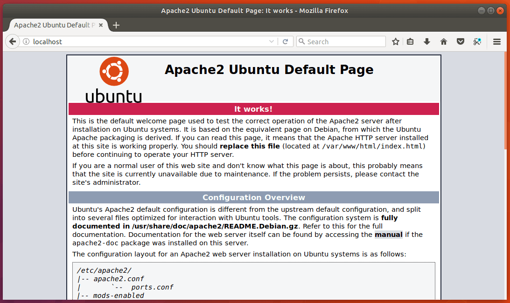
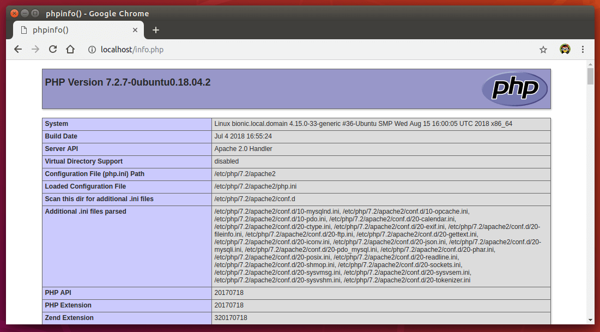

# Ubuntu üzerinde PHP geliştirme ortamı kurulumu

Önceki sayfada da bahsettiğimiz gibi, Ubuntu işletim sistemimize kurmamız gereken yazılımlar şunlar:

* Web Sunucusu
* PHP kod çalıştırıcısı
* MySQL veritabanı


> **Not:** Bu komutları yetkisiz bir kullanıcı ile çalıştıramazsınız, eğer root erişiminiz ya da sudo yetkili bir kullanıcınız yoksa, öncelikle bunu elde etmeye çalışın.

Öncelikle sistemimizi güncelleştiriyoruz:

```bash
sudo apt-get update
sudo apt-get upgrade
```


## Otomatik kurulum yolları

### 1. `tasksel` komutu ile

Öncelikle kurulmamışsa `tasksel` komutunu kuruyoruz:

```bash
sudo install tasksel
```

Daha sonra tüm gerekli programların (LAMP) kurulumu için şu komutu çalıştırıyoruz:

 ```shell
sudo tasksel install lamp-server
 ```


### 2. `wget|bash` ile

GitHub gist'lerinde bir arkadaşımız güzel bir kurulum scripti hazırlamış, fork edip (bir kopyasını kendi hesabınızda oluşturarak) eskide kalmış versiyonları yeni versiyonlarla değiştirerek güncelleyip de kullanabilirsiniz, şu anki haliyle de öğrenmek için kurabilirsiniz. Komutun detayına https://gist.github.com/EmpireWorld/737fbb9f403d4dd66dee1364d866ba7e adresine giderek ulaşabilirsiniz. 

Çalıştırılması yeterli olacak komut:

```bash
wget --no-cache -O - https://gist.github.com/EmpireWorld/737fbb9f403d4dd66dee1364d866ba7e/raw/install-lamp.sh | bash
```

Tabi, linux `wget` komutunu bulamayabilir, bulamadığı zaman kurmak için `sudo apt-get install wget`komutunu çalıştırarak kolayca kurulumu sağlayabilirsiniz. 


## Manuel kurulum

### Apache web sunucusu kurulumu

Web sunucusu olarak görev yapacak olan Apache'yi kuruyoruz:

```bash
sudo apt-get install apache2
```

Kurduğumuz web sunucusunu servis olarak aktive edip, sistem açılışında da otomatik olarak çalışmasını sağlamak için şu komutları kullanıyoruz:

```bash
sudo systemctl start apache2
sudo systemctl enable apache2
```

Herşeyin yolunda olup olmadığını görmek için şu komutu çalıştırıp Status: Running yazısını arıyoruz:

```bash
sudo systemctl status apache2
```

**Not:** Bu sunucunun yayın yapabilmesi için ubuntu firewall tarafından bazı izinlerin verilmesi gerekebilir, bunu yapmak için eğer sistemimiz `ufw` kullanıyorsa `sudo ufw allow http` komutunu, `iptables` kullanıyorsa da `sudo iptables -I INPUT -p tcp --dport 80 -j ACCEPT` komutunu çalıştırmamız gerekebilir.

 

### PHP 7.2 Kurulumu

PHP kurulumu için öncelikle OndrejPPA dosya deposunun sisteme tanıtılması gerekiyor, aksi halde bu programı standart depolarda bulamıyoruz.

```bash
sudo apt-get install software-properties-common python-software-properties
sudo add-apt-repository -y ppa:ondrej/php
sudo apt-get update
```

Bu adımdan sonra PHP7.2'yi kurmak için şu komutu çalıştırıyoruz:

```bash
sudo apt-get install php7.2 php7.2-cli php7.2-common
```

PHP ile beraber gelen çok kullanılan uzantıları da ekliyoruz

```bash
sudo apt-get install php7.2-curl php7.2-gd php7.2-json php7.2-mbstring php7.2-intl php7.2-mysql php7.2-xml php7.2-zip
```

Kurulumun başarılı olarak tamamlanıp tamamlanmadığını `php -v` komutuyla test edebiliriz, bu komut çalıştırıldığında şuna benzer bir çıktı karşımıza çıkmalı:

```bash
PHP 7.2.9-1+ubuntu16.04.1+deb.sury.org+1 (cli) (built: Aug 19 2018 07:16:12) ( NTS )
Copyright (c) 1997-2018 The PHP Group
Zend Engine v3.2.0, Copyright (c) 1998-2018 Zend Technologies
    with Zend OPcache v7.2.9-1+ubuntu16.04.1+deb.sury.org+1, Copyright (c) 1999-2018, by Zend Technologies
```

Bunu görüyorsak kurulum başarılı olmuş demektir.


### MySQL kurulumu

Kurulumu şu komutla gerçekleştiriyoruz:

```bash
sudo apt-get install mysql-server
```

Bu komutu çalıştırdıktan sonra MySQL'in güvenlik ayarlarını tamamlamamız gerekiyor:

```bash
sudo mysql_secure_installation
```

Bu komut çalıştırıldığında MySQL size root kullanıcısı için bir şifre belirlemenizi isteyecek. Bu şifreyi kullanarak ileride gerçekleştireceğimiz tüm işlemler için veritabanına bağlanacağız. O yüzden unutmayacağınız bir şifre seçmek yararınıza olacaktır. Daha sonraki soruları Enter tuşuna basarak geçebilirsiniz. Zira sizden yapılmasına onay vermenizi istedikleri şeyler herhangi bir çalışmanızı engellemeyecek ve sistem güvenliğinizi artıracak şeyler. 


Tüm işlemleri yaptıktan sonra http://localhost ya da http://127.0.0.1 adresine tarayıcıyla girdiğnizde şu ekranı görmemiz gerekiyor:



Bu sayfanın yeri `/var/www/html` yolunda bulunan `index.html` dosyasıdır ve oradan yayınlanmaktadır. Buraya ekleyeceğiniz her PHP dosyası apache tarafından sunulacaktır.

Örneğin, `/var/www/html/info.php` dosyasını oluşturup içerisine `<?php phpinfo();?>` yazalım. Tarayıcımızı açıp http://localhost/info.php adresini sorguladığımızda şu ekranı görmemiz gerekiyor:




