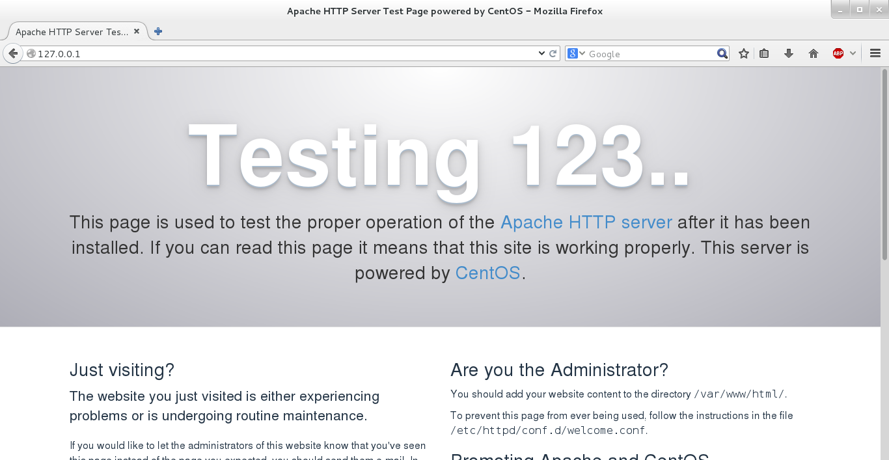
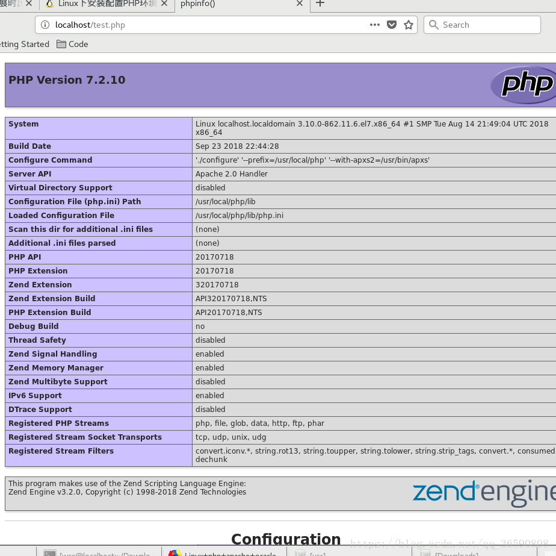

[//]: # (Title: CentOS)
# CentOS üzerinde PHP geliştirme ortamı kurulumu

Ubuntu işletim sisteminde kurduğumuz programların aynısını burada da kurmamız gerekiyor:

* Web Sunucusu
* PHP kod çalıştırıcısı
* MySQL veritabanı

> **Not:** Bu komutları yetkisiz bir kullanıcı ile çalıştıramazsınız, eğer root erişiminiz ya da sudo yetkili bir kullanıcınız yoksa, öncelikle bunu elde etmeye çalışın.

Öncelikle sistemimize epel-release adlı kaynak depoları eklememiz gerekiyor:

**Centos 6**

```bash
sudo yum install https://dl.fedoraproject.org/pub/epel/epel-release-latest-6.noarch.rpm
sudo yum install http://rpms.remirepo.net/enterprise/remi-release-6.rpm
sudo yum install yum-utils
```

**Centos 7**

```bash
sudo yum -y install epel-release
sudo yum install yum-utils
```

Sistemimizdeki depo içerik listesini güncelleştiriyoruz.


## Otomatik Kurulum

### lamp.sh

Github'da gezerken bulduğum bir toplu yükleme paketi, denemedim. https://github.com/teddysun/lamp#installation adresinde detayları bulabilirsiniz. İçeriğine de bakma fırsatım olmadı, ancak güvenlik açısından manuel kurulumu tercih ederim gibi düşünüyorum, zira resmi firma harici insanların script'lerini okumadan bilgisayarda çalıştırmak, zarar görmenize sebep olabilir (backdoor, ransomware etc). Ancak şu da var, 2000 küsür yıldız ve 800 küsür fork ile güvenliği kanıtlanmıştır diye de düşünebiliriz. Bu da başka bir gösterge.

Kurmak için kullandığı kod:

```bash
yum -y install wget screen git
git clone https://github.com/teddysun/lamp.git
cd lamp
chmod 755 *.sh
screen -S lamp
./lamp.sh
```


## Manuel Kurulum

### Apache web sunucusu kurulumu

Web sunucusu olarak görev yapacak olan Apache'yi kuruyoruz:

```bash
sudo yum install httpd
```

Kurduğumuz web sunucusunu servis olarak aktive edip, sistem açılışında da otomatik olarak çalışmasını sağlamak için şu komutları kullanıyoruz:

```bash
sudo systemctl start httpd
sudo systemctl enable httpd
```

Herşeyin yolunda olup olmadığını görmek için şu komutu çalıştırıp Status: Running yazısını arıyoruz:

```bash
sudo systemctl status httpd
```

**Not:** Bu sunucunun yayın yapabilmesi için ubuntu firewall tarafından bazı izinlerin verilmesi gerekebilir, bunu yapmak için eğer sistemimiz `ufw` kullanıyorsa `sudo ufw allow http` komutunu, `iptables` kullanıyorsa da `sudo iptables -I INPUT -p tcp --dport 80 -j ACCEPT` komutunu çalıştırmamız gerekebilir.

 

### PHP 7.2 Kurulumu

En başta sistem hazırlığında EPEL ve remi repository'sini dahil etmiştik. PHP 7.2 versiyonunu aktive etmek için şu komutu çalıştırıyoruz:

```bash
sudo yum-config-manager --enable remi-php72
sudo yum update
```

PHP ile beraber gelen çok kullanılan uzantıları da ekliyoruz

```bash
sudo yum install -y php php-cli php-curl php-gd php-json php-mbstring php-intl php-mysql php-xml php-zip
```

Kurulumun başarılı olarak tamamlanıp tamamlanmadığını `php -v` komutuyla test edebiliriz, bu komut çalıştırıldığında şuna benzer bir çıktı karşımıza çıkmalı:

```bash
PHP 7.2.10 (cli) (built: Sep 11 2018 10:09:51) ( NTS )
Copyright (c) 1997-2018 The PHP Group
Zend Engine v3.2.0, Copyright (c) 1998-2018 Zend Technologies
    with Zend OPcache v7.2.10, Copyright (c) 1999-2018, by Zend Technologies
```

Bunu görüyorsak kurulum başarılı olmuş demektir.


### MySQL kurulumu

Kurulumu şu komutla gerçekleştiriyoruz:

```bash
sudo yum install mariadb-server mariadb
```

Yine Apache'de olduğu gibi servisin işletim sistemi açılışında çalışmasını istiyoruz, o yüzden bu komutu çalıştırıyoruz:

```bash
sudo systemctl start mariadb
sudo systemctl enable mariadb
```

Bu komutu çalıştırdıktan sonra MySQL'in güvenlik ayarlarını tamamlamamız gerekiyor:

```bash
sudo mysql_secure_installation
```

Bu komut çalıştırıldığında MySQL size root kullanıcısı için bir şifre belirlemenizi isteyecek. Bu şifreyi kullanarak ileride gerçekleştireceğimiz tüm işlemler için veritabanına bağlanacağız. O yüzden unutmayacağınız bir şifre seçmek yararınıza olacaktır. Daha sonraki soruları Enter tuşuna basarak geçebilirsiniz. Zira sizden yapılmasına onay vermenizi istedikleri şeyler herhangi bir çalışmanızı engellemeyecek ve sistem güvenliğinizi artıracak şeyler. 


Tüm işlemleri yaptıktan sonra http://localhost ya da http://127.0.0.1 adresine tarayıcıyla girdiğnizde şu ekranı görmemiz gerekiyor:



Bu sayfanın yeri `/var/www/html` yolunda bulunan `index.html` dosyasıdır ve oradan yayınlanmaktadır. Buraya ekleyeceğiniz her PHP dosyası apache tarafından sunulacaktır.

Örneğin, `/var/www/html/info.php` dosyasını oluşturup içerisine `<?php phpinfo();?>` yazalım. Tarayıcımızı açıp http://localhost/info.php adresini sorguladığımızda şu ekranı görmemiz gerekiyor:



